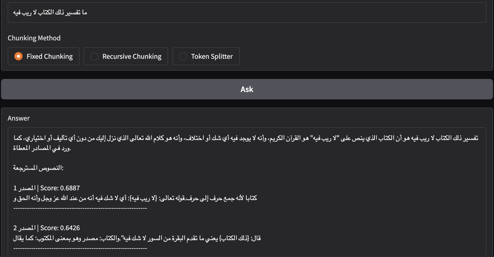

# Arabic Tafseer RAG Demo

This repository contains `main.ipynb`, a notebook that builds a simple Retrieval-Augmented Generation (RAG) chatbot for Arabic Quran tafseer.

The notebook loads the [Quran Tafseer RAG Dataset](https://huggingface.co/datasets/omaressam1111/multi-tafseer-quran-rag), creates text chunks, embeds them, retrieves relevant tafseer passages for a user question, and generates an Arabic answer using the retrieved context.

## What the Notebook Does

1. Loads a verse-aligned Arabic tafseer dataset from Hugging Face.
2. Extracts `text_for_embedding` from the first 10,000 training records.
3. Compares three chunking methods:
   - Fixed chunking
   - Recursive chunking
   - Token-based splitting
4. Generates embeddings with `NAMAA-Space/AraModernBert-Base-STS`.
5. Performs similarity search over the embedded chunks.
6. Builds an Arabic RAG prompt from retrieved passages.
7. Generates an answer with `microsoft/Phi-4-mini-instruct`.
8. Serves a small Gradio interface for asking tafseer questions.


## Dependencies

The notebook uses:

- `datasets`
- `numpy`
- `langchain-text-splitters`
- `tiktoken`
- `sentence-transformers`
- `transformers`
- `torch`
- `tqdm`
- `gradio`

Some dependencies are installed inside notebook cells, but you can also install them manually:

```bash
pip install datasets numpy langchain-text-splitters tiktoken sentence-transformers transformers torch tqdm gradio
```

## How to Run

1. Open `main.ipynb` in Jupyter Notebook, JupyterLab, VS Code, or Google Colab.
2. Run the cells from top to bottom.
3. Wait for the dataset, embedding model, and language model to load.
4. Launch the Gradio app from the final interface cell.
5. Enter an Arabic tafseer question and choose a chunking method.

Example question:

```text
ما تفسير ذلك الكتاب لا ريب فيه
```

## Output Screenshot

The screenshot below shows the Gradio app answering an Arabic tafseer question and displaying the retrieved source passages with similarity scores.



## Notes

- The notebook currently encodes chunks in memory, so model loading and embedding generation can take time.
- `microsoft/Phi-4-mini-instruct` may require enough RAM or GPU memory depending on the runtime.
- Retrieval quality can vary depending on the selected chunking method.
